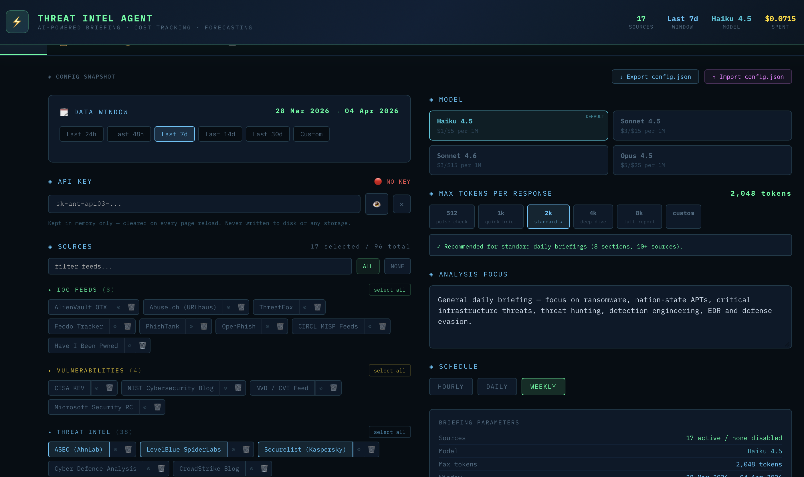
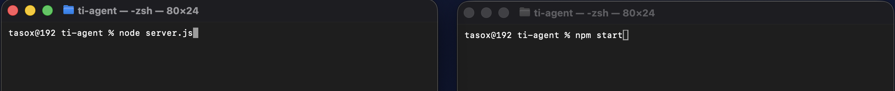
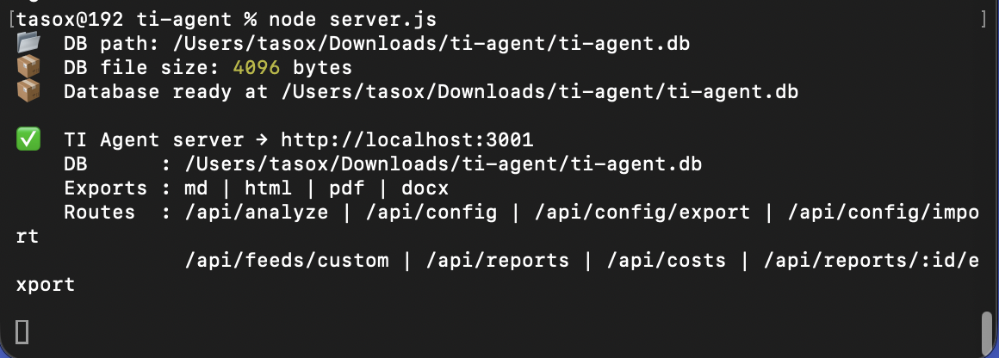
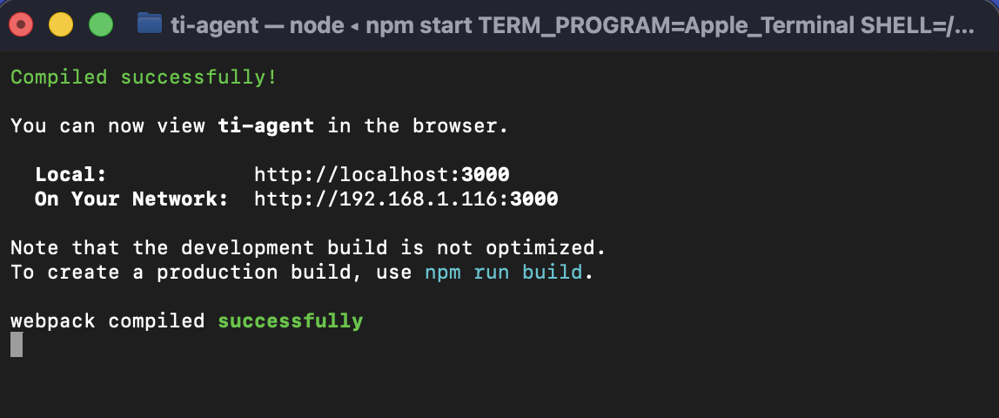

# TI Agent — AI-Powered Threat Intelligence Briefing Tool

TI Agent is a full-stack local application that fetches real security articles from RSS/Atom feeds, passes them to Claude for analysis, and produces structured threat intelligence briefings with inline citations linking directly to the source articles.

Unlike tools that prompt an LLM with feed URLs and hope for the best, TI Agent actually fetches and parses the feeds server-side, filters articles to your chosen date window, and sends the real content to Claude. Every claim in the report traces to a specific article, and every `[N]` citation is a clickable link to that article's URL.

Beyond briefings, the **Hunt** tab turns any saved report into structured, citation-grounded threat hunting hypotheses and merges a selection into one consolidated, filterable HTML dashboard — usable with either a metered API key or a local Claude Code (subscription) login.



---

## Features

- **97 builtin security feeds** across 6 categories: IOC Feeds, Vulnerabilities, Threat Intel, Red|Blue|Purple, Security News, CTF & Learning
- **Real RSS/Atom ingestion** — articles fetched and parsed server-side, filtered to your date window before Claude sees them
- **Inline citations** — every factual claim in the report is followed by `[N]` badges linking to the source article
- **Authoritative references section** — rebuilt from the actual source map after generation, guaranteeing completeness and no duplicates
- **4 export formats** — Markdown (with hyperlinked citations), HTML, PDF (dark theme, print-ready), DOCX (proper ZIP-based `.docx`)
- **Bulk report export** — select one, several, or all saved reports in the History tab and export them together in a single chosen format
- **Threat hunting hypotheses** — derive structured, citation-grounded hunting hypotheses from any saved report and merge a selection into one consolidated, filterable interactive HTML dashboard (light or dark theme)
- **Claude subscription auth** — extract hypotheses via a local, logged-in Claude Code CLI instead of a metered API key, with no extra setup beyond `claude login`
- **Cost tracking & forecasting** — per-run token usage, actual vs. estimated cost accuracy, 30-day budget projections
- **Full persistence** — all reports, hypotheses, config, and custom feeds saved to SQLite; survive server restarts
- **Custom feeds** — add any RSS/Atom feed URL with a name and category
- **Feed management** — enable, disable, rename/re-point, or permanently delete any feed (builtin or custom)
- **Config export/import** — snapshot and restore your entire configuration as JSON
- **4 Claude models** — Haiku 4.5 (default), Sonnet 4.5, Sonnet 4.6, Opus 4.5

---

## How It Works

```
┌─────────────────────────────────────────────────────────┐
│                    Browser (React)                      │
│  CONFIG tab → select feeds, date window, model, focus  │
│                        │                               │
│             Click "Generate Briefing"                  │
└────────────────────────┬────────────────────────────────┘
                         │ POST /api/fetch-feeds
                         ▼
┌─────────────────────────────────────────────────────────┐
│                 Express Server :3001                    │
│                                                         │
│  1. Fetch all selected feeds in parallel (8s timeout)  │
│  2. Parse RSS 2.0 / Atom 1.0 XML                       │
│  3. Filter articles to date window                     │
│  4. Cap at 15 articles per feed                        │
│  5. Return { articles[], errors[] }                    │
└────────────────────────┬────────────────────────────────┘
                         │ articles arrive in browser
                         │ POST /api/analyze
                         ▼
┌─────────────────────────────────────────────────────────┐
│                 Express Server :3001                    │
│                                                         │
│  Proxy to Anthropic API with prompt containing:        │
│  - Numbered article list [1]..[N] with title/URL/date/ │
│    summary for each article                            │
│  - Citation rule: cite [N] after every claim           │
│  - Structured report sections                          │
└────────────────────────┬────────────────────────────────┘
                         │ Claude response
                         ▼
┌─────────────────────────────────────────────────────────┐
│                    Browser (React)                      │
│                                                         │
│  - rebuildReferences() strips Claude's References      │
│    section and rebuilds it from the source map         │
│  - renderMarkdown() renders [N] as clickable <a> links │
│  - Report saved to SQLite with source_map JSON         │
└─────────────────────────────────────────────────────────┘
```

### Report Sections

Every report follows this structure:

| # | Section | Description |
|---|---------|-------------|
| 1 | Data Window | Date range covered and article count |
| 2 | Executive Summary | 3-4 sentence CISO-level summary with citations |
| 3 | Top Threats | Up to 5 ranked threats (CRITICAL / HIGH / MEDIUM) |
| 4 | IOC Highlights | Real IOCs from articles only — IPs, domains, hashes |
| 5 | CVE Watch | Explicitly mentioned CVEs in table format |
| 6 | Threat Actor Spotlight | Named actors with TTPs and MITRE IDs |
| 7 | Analyst Recommendations | 3 actionable steps |
| 8 | MITRE ATT&CK Coverage | Techniques in table format |
| 9 | References | Complete deduplicated list of cited articles |

---

## Hunting Hypotheses

The **🎯 HUNT** tab turns already-saved reports into structured, actionable threat hunting hypotheses, then merges a selection of them into one consolidated interactive HTML dashboard — separate from the narrative briefing export above.

### How it works

1. Go to the **HUNT** tab and select one or more saved reports (checkboxes — no prior extraction required).
2. Click **⚡ GENERATE CONSOLIDATED HTML**. This single action:
   - Extracts hypotheses for any selected report that doesn't have them yet (skips ones that are already extracted, unless you check **re-extract already processed**).
   - Merges every selected report's hypotheses — across however many different briefing windows — into one downloadable HTML file, with category and briefing-window filters, expandable cards, and summary counters.
3. The downloaded file is fully self-contained (inline CSS/JS, no external dependencies) and safe to share or archive on its own.

Each hypothesis is grounded only in its source report's own cited content — the extraction prompt is instructed not to introduce outside knowledge, and every `[N]` citation token is resolved against that report's own source map, so reference links can never be hallucinated.

### Auth modes

| Mode | How it works | Cost |
|------|--------------|------|
| **API Key** *(default)* | Uses the same Anthropic API key configured in the CONFIG tab | Metered, billed per token |
| **Claude Subscription** | Shells out to a local, already-logged-in Claude Code CLI (`claude -p`) | Uses your Claude Pro/Max subscription — no API billing, no key needed |

Claude Subscription mode requires the [Claude Code CLI](https://docs.claude.com/en/docs/claude-code) installed and authenticated once via `claude login` (run manually in any terminal — TI Agent never runs this for you, since it's an interactive browser-based login). See [Troubleshooting](#troubleshooting) if the server can't find the `claude` binary.

### Hypothesis fields

Each extracted hypothesis has this shape:

| Field | Description |
|-------|-------------|
| `priority` | `critical` \| `high` \| `medium` |
| `category` | `Network` \| `Endpoint` \| `Cloud` \| `Identity` \| `Supply Chain` |
| `title` | Short one-line hunt title |
| `hypothesis` | 2-4 sentence hunting rationale, with `[N]` citations preserved |
| `where` | Systems/logs/environments to look in |
| `data_sources` | Specific log sources or telemetry types |
| `query` | Pseudo detection-logic sketch |
| `mitre` | MITRE ATT&CK technique IDs and names |
| `iocs` | Specific indicators or artefact patterns to hunt for |
| `refs` | `{label, url}` pairs resolved from the source report's citations |

### Theme

The consolidated HTML can be generated in **☀ Light** (default, matches the original reference dashboard design) or **🌙 Dark** (matches TI Agent's own dark palette — same severity colors and citation-link styling used elsewhere in the app). Pick a theme with the toggle next to the Generate button before clicking it.

---

## Requirements

| Requirement | Version | Notes |
|-------------|---------|-------|
| Node.js | **22.x** | Express 4 breaks on Node 22 — Node 22 required |
| macOS | 12+ | Tested on macOS; Linux compatible; Windows untested |
| Anthropic API key | — | `sk-ant-api03-...` format. Required for briefing generation and for the Hunt tab's default API Key mode |
| Xcode CLI tools | — | Required for `better-sqlite3` native build |
| Claude Code CLI *(optional)* | — | Only needed for the Hunt tab's **Claude Subscription** auth mode — install it and run `claude login` once. Not required for anything else |

---

## Dependencies

### Runtime (npm)

| Package | Version | Purpose |
|---------|---------|---------|
| `express` | `^5.x` | HTTP server and routing. **Must be v5** — Express 4 is incompatible with Node 22's bundled `path-to-regexp` |
| `cors` | `^2.x` | Cross-origin headers so the React dev server on :3000 can call :3001 |
| `node-fetch` | `@2.x` | HTTP client for fetching RSS feeds and proxying to Anthropic. **Must be v2** — v3 is ESM-only and incompatible with CommonJS `require()` |
| `better-sqlite3` | `^9.x` | Synchronous SQLite driver. Requires native build tools (Xcode CLI on macOS) |

### Built-in (Node.js — no install needed)

| Module | Used for |
|--------|---------|
| `path` | Resolving the DB file path relative to `server.js` |
| `fs` | Startup DB file stat check; locating the Claude CLI binary |
| `os` | Resolving `$HOME` when searching for the Claude CLI install location |
| `zlib` | `deflateRawSync` for building valid `.docx` ZIP archives |
| `child_process` | `execFile`-ing the local Claude Code CLI for Hunt tab subscription auth |

### Frontend (included in Create React App)

| Package | Purpose |
|---------|---------|
| `react` | UI framework |
| `react-dom` | DOM rendering |
| `react-scripts` | CRA build toolchain, dev server, Babel |

### External services

| Service | Used for |
|---------|---------|
| Anthropic API | Claude inference (`/v1/messages`) — proxied through local server, API key never stored on disk |
| Google Fonts (optional) | IBM Plex Mono font in HTML/PDF exports — falls back to Courier New if offline |

---

## Installation

### 1. Prerequisites

```bash
# macOS — install Xcode command line tools (required for better-sqlite3)
xcode-select --install

# Install Node 22 via Homebrew if not already installed
brew install node
node --version  # should print v22.x.x
```

### 2. Clone the repository

```bash
git clone https://github.com/<your-username>/ti-agent.git
cd ti-agent
```

### 3. Install dependencies

The repo ships with a ready-to-use `package.json` covering both frontend and backend dependencies:

```bash
npm install
```

This installs `react`, `react-dom`, `react-scripts`, `express@5`, `cors`, `node-fetch@2`, and `better-sqlite3` in one step.

### 4. Project location

**Important:** Do not place the project inside iCloud Drive (`~/Library/Mobile Documents/`). iCloud's sync mechanism interferes with SQLite's WAL journal files and can cause database corruption or invisible DB files. Clone into a local path such as `~/Projects/ti-agent`.

---

## Running



Open two terminal windows in the project directory:

```bash
# Terminal 1 — backend (port 3001)
node server.js
```

You should see:
```
📂  DB path: /Users/you/Downloads/ti-agent/ti-agent.db
📦  DB file size: 32768 bytes
📦  Database ready at /Users/you/Downloads/ti-agent/ti-agent.db

✅  TI Agent server → http://localhost:3001
```


```bash
# Terminal 2 — frontend (port 3000)
npm start
```


Open **http://localhost:3000** in your browser.

---

## First Run

1. Go to the **⚙ CONFIG** tab
2. Enter your Anthropic API key — it is kept in memory only and cleared on every page reload, never written to disk
3. Select your feeds and date window
4. Click **⚡ GENERATE BRIEFING**

The button label will cycle through two phases:
- `◌ FETCHING N FEEDS…` — downloading and parsing RSS/Atom feeds
- `◌ ANALYZING WITH AI…` — Claude processing the articles


---

## Database

The SQLite database (`ti-agent.db`) is created automatically in the same directory as `server.js` on first run. It contains four tables:

### `config`
Key/value store for all UI preferences. Values are JSON-serialized.

| Key | Type | Description |
|-----|------|-------------|
| `selectedIds` | `string[]` | Feed IDs selected for analysis |
| `selectedModelId` | `string` | Active Claude model |
| `query` | `string` | Analysis focus prompt |
| `schedule` | `string` | Schedule preference label |
| `maxTokens` | `number` | Claude max output tokens |
| `datePreset` | `number` | Index into date preset array |
| `customFrom` / `customTo` | `string` | Custom date range (YYYY-MM-DD) |
| `disabledIds` | `string[]` | Feeds temporarily disabled |
| `deletedIds` | `string[]` | Feeds permanently removed |
| `feedOverrides` | `{ [feedId]: {name, url, xmlUrl} }` | Renamed/re-pointed **built-in** feeds — merged onto the hardcoded feed list at render time. Edits to **custom** feeds instead update their `custom_feeds` row directly |

### `custom_feeds`
User-added RSS/Atom feeds.

| Column | Type | Description |
|--------|------|-------------|
| `id` | TEXT PK | Unique identifier |
| `name` | TEXT | Display name |
| `xmlUrl` | TEXT | RSS/Atom feed URL |
| `url` | TEXT | Human-readable site URL |
| `category` | TEXT | Feed category |
| `color` | TEXT | Hex color for UI |
| `created_at` | TEXT | ISO timestamp |

### `reports`
Generated briefings with full metadata.

| Column | Type | Description |
|--------|------|-------------|
| `id` | INTEGER PK | Auto-increment |
| `timestamp` | TEXT | Human-readable generation time |
| `query` | TEXT | Analysis focus used |
| `date_from` / `date_to` | TEXT | Date window |
| `sources` | INTEGER | Number of feeds selected |
| `model_id` / `model_name` | TEXT | Claude model used |
| `input_tokens` / `output_tokens` | INTEGER | Actual token usage |
| `input_cost` / `output_cost` / `total_cost` | REAL | Actual costs in USD |
| `est_input_tok` / `est_output_tok` / `est_total_cost` | REAL | Pre-flight estimates |
| `body` | TEXT | Full Markdown report |
| `source_map` | TEXT | JSON mapping `{"1": {name, url}, ...}` for citations |
| `created_at` | TEXT | ISO timestamp |

### `hypotheses`
Extracted threat hunting hypotheses, one row per hypothesis, linked to the report they were derived from. Re-extracting a report deletes and replaces all of its rows.

| Column | Type | Description |
|--------|------|-------------|
| `id` | INTEGER PK | Auto-increment |
| `report_id` | INTEGER | FK to `reports.id` (indexed) |
| `priority` | TEXT | `critical` \| `high` \| `medium` |
| `category` | TEXT | `Network` \| `Endpoint` \| `Cloud` \| `Identity` \| `Supply Chain` |
| `title` | TEXT | Short hunt title |
| `hypothesis` | TEXT | Hunting rationale, with `[N]` citations |
| `where_to_look` | TEXT | Systems/logs/environments to search |
| `data_sources` | TEXT | JSON array of log sources / telemetry types |
| `query_logic` | TEXT | Pseudo detection-logic sketch |
| `mitre` | TEXT | JSON array of MITRE ATT&CK technique IDs/names |
| `iocs` | TEXT | JSON array of indicators/artefact patterns |
| `refs` | TEXT | JSON array of `{label, url}`, resolved from the source report's citations |
| `created_at` | TEXT | ISO timestamp |

### Migrations

The server runs non-destructive migrations at startup. Adding columns to the schema will not break existing databases — the `ALTER TABLE` statements are wrapped in `try/catch` so already-existing columns are silently skipped.

---

## API Reference

All endpoints are on `http://localhost:3001`.

| Method | Path | Description |
|--------|------|-------------|
| `GET` | `/health` | Server health check, returns DB path |
| `POST` | `/api/fetch-feeds` | Fetch and parse RSS/Atom feeds for a date window |
| `POST` | `/api/analyze` | Proxy to Anthropic `/v1/messages` (API key auth) |
| `POST` | `/api/analyze-cli` | Proxy to a local Claude Code CLI (subscription auth) — same response shape as `/api/analyze` |
| `GET` | `/api/config` | Load all saved config |
| `PUT` | `/api/config` | Save config (API key is always excluded) |
| `GET` | `/api/config/export` | Download full config + custom feeds as JSON |
| `POST` | `/api/config/import` | Restore config from exported JSON |
| `GET` | `/api/feeds/custom` | List custom feeds |
| `POST` | `/api/feeds/custom` | Add a custom feed |
| `PUT` | `/api/feeds/custom/:id` | Rename or re-point an existing custom feed |
| `DELETE` | `/api/feeds/custom/:id` | Remove a custom feed |
| `GET` | `/api/reports` | List all reports (no body field) |
| `GET` | `/api/reports/:id` | Get a single report with body |
| `POST` | `/api/reports` | Save a generated report |
| `DELETE` | `/api/reports/:id` | Delete a report (cascades to its hypotheses) |
| `GET` | `/api/costs` | Get cost ledger rows |
| `GET` | `/api/reports/:id/export?format=` | Export report (md / html / pdf / docx) |
| `POST` | `/api/reports/:id/hypotheses` | Replace a report's stored hypotheses |
| `GET` | `/api/reports/:id/hypotheses` | List a report's stored hypotheses |
| `GET` | `/api/hypotheses/counts` | `{ [report_id]: count }` for every report, in one query |
| `GET` | `/api/hypotheses/consolidated?reportIds=&theme=` | Consolidated hunting-hypotheses HTML for a set of reports (`theme` = `light` \| `dark`, default `light`) |

### `POST /api/fetch-feeds`

Request body:
```json
{
  "feeds": [
    { "id": "talos", "name": "Cisco Talos", "xmlUrl": "https://blog.talosintelligence.com/feed", "url": "https://blog.talosintelligence.com" }
  ],
  "dateFrom": "2025-01-01",
  "dateTo": "2025-01-07"
}
```

Response:
```json
{
  "articles": [
    {
      "title": "Article title",
      "url": "https://...",
      "date": "2025-01-03",
      "summary": "First 800 chars of article text...",
      "feedName": "Cisco Talos",
      "feedIndex": 1
    }
  ],
  "errors": [
    { "feed": "Some Feed", "error": "Timeout" }
  ]
}
```

Feed fetcher behaviour:
- Fetches all feeds in parallel with `Promise.allSettled`
- 8-second timeout per feed (`AbortController`)
- Caps at 15 articles per feed before sending to Claude
- Articles outside the date window are filtered out
- Feeds that fail (timeout, HTTP error, parse error) appear in `errors[]` and are noted in the report

---

## Export Formats

| Format | Citations | Tables | Notes |
|--------|-----------|--------|-------|
| `.md` | `[N](url)` markdown hyperlinks | GFM pipe tables | Compatible with Obsidian, GitHub, Typora |
| `.html` | `<a>` superscript links | `<table>` with dark CSS | Self-contained, dark theme matching the app |
| `.pdf` | `<a>` superscript links | `<table>` with dark CSS | Opens print dialog — enable "Background graphics" in Chrome |
| `.docx` | Blue superscript `[N]` text | `<w:tbl>` Word tables | Valid ZIP-based DOCX, opens in Word and LibreOffice without errors |

All formats automatically rebuild the References section from the stored `source_map` before exporting, guaranteeing that every cited article appears exactly once and no references are missing.

Every export (single report or bulk) is named after that report's own date window:
```
threat-intel_report_start-DDMMYYYY_end-DDMMYYYY.<ext>
```

### Bulk export

The **History** tab lets you select one, several, or all saved reports (checkboxes + an `ALL`/`NONE` toggle) and export them all at once in a single chosen format (MD/HTML/PDF/DOCX). Each selected report downloads as its own file — bulk export doesn't merge reports together, it just triggers one download per report, staggered slightly so browsers don't block them as a popup flood.

---

## Supported Claude Models

| Model | API ID | Input | Output | Best for |
|-------|--------|-------|--------|---------|
| Haiku 4.5 *(default)* | `claude-haiku-4-5-20251001` | $1.00/1M | $5.00/1M | Daily briefings, high volume |
| Sonnet 4.5 | `claude-sonnet-4-5-20251101` | $3.00/1M | $15.00/1M | Balanced quality and cost |
| Sonnet 4.6 | `claude-sonnet-4-6` | $3.00/1M | $15.00/1M | Latest capabilities |
| Opus 4.5 | `claude-opus-4-5` | $5.00/1M | $25.00/1M | Deep analysis, complex reports |

---

## Security Notes

- The Anthropic API key is **never written to disk or any browser storage**. It lives in React component state only and is cleared on every page reload.
- The backend strips the `apiKey` field from all config saves (`PUT /api/config`) and config exports (`GET /api/config/export`).
- The server has no authentication. It is designed for local single-user use only. Do not expose port 3001 to a network.
- All feed fetching is done server-side with a browser-like `User-Agent` header for research use.

---

## Troubleshooting

**`Missing parameter name` crash on `node server.js`**
You have Express 4 installed. Run `npm install express@5` to upgrade.

**`Cannot find module 'node-fetch'`**
Run `npm install node-fetch@2`. Note the `@2` — v3 is incompatible.

**`better-sqlite3` fails to build**
Install Xcode command line tools: `xcode-select --install`. On Linux, install `build-essential` and `python3`.

**DB file not created / not visible**
The DB is created in the same directory as `server.js`. If the project is inside iCloud Drive, iCloud may be syncing the file to the cloud. Move the project to a local path outside `~/Library/Mobile Documents/`.

**No articles found in window**
Most feeds publish infrequently. Try widening the date window (7d or 14d). Some feeds (NVD, OTX) require authentication or have non-standard feed formats and may return zero articles. Check the server terminal — failed feeds are logged with the specific error.

**PDF exports with white background**
In Chrome's print dialog, enable **Background graphics** (More settings → Background graphics). The CSS sets the dark background with `print-color-adjust: exact` on the `html` element, but Chrome's print dialog overrides it unless that option is checked.

**DOCX opens with "unreadable content" warning**
This should be fixed in the current version — the DOCX is now a proper ZIP archive. If you still see the warning, you may have an older `server.js`. Ensure you are running the latest version.

**Hunt tab: "Claude CLI not found" even after `claude login`**
`claude login` persists credentials to disk and isn't tied to any particular terminal, so this is virtually always a `PATH` issue, not an auth issue. Node's `execFile()` never spawns a shell, so it only ever sees the `PATH` the `node server.js` process itself started with — it does **not** read `.zshrc`/`.bash_profile`. If the Claude Code installer added itself to your shell rc file *after* your terminal was already open, that terminal (and anything started from it) won't see it until you open a new one. `server.js` checks a few common install locations (`~/.local/bin`, `~/.claude/local/bin`, `/opt/homebrew/bin`, `/usr/local/bin`) automatically and logs which one it resolved at startup:
```
🔎  Claude CLI resolved to: /Users/you/.local/bin/claude
```
If that line is missing or points to the wrong place, restart `node server.js` from a fresh terminal (Node only reads a file once at startup — editing it or re-logging in doesn't affect an already-running process). Reinstalling the app or its dependencies is never required for this — only a server restart.
